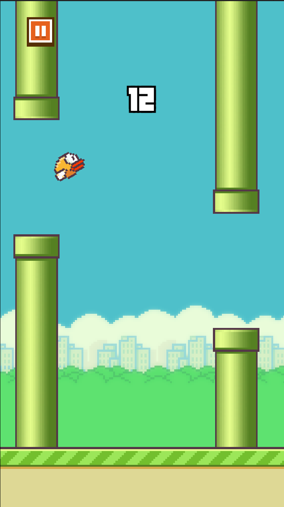

# Jumpy Birb - Unity Flappy Bird Clone

## Project Information

|               |                  |
|---------------|------------------|
| Unity Version |  2020.3.23f1 LTS |

## IMPORTANT! PLEASE READ

To properly debug this project in the Unity Editor, it is necessary to open the **Master Scene** named `"SCN_master"` as the active scene, and then add the desired target scene additively. The figure below shows how the hierarchy should look like after setting up the **Master Scene** for debugging:

## Screenshots

</img>
</img>
</img>
 

## Third-Party Assets Used

| Package | Location | Source   |
|---------|----------|----------|
| Dotween | `Assets/ThirdParty/Plugins/Demigiant` | [https://assetstore.unity.com/packages/tools/animation/dotween-hotween-v2-27676] |
| MinMaxSliderAttribute | `Assets/ThirdParty/MinMaxSliderAttribute` | [https://gist.github.com/frarees/9791517] |
| Flappy Bird Unity Project | `Assets/ThirdParty` | [https://develion.itch.io/flappy-bird-unity-project]

***
